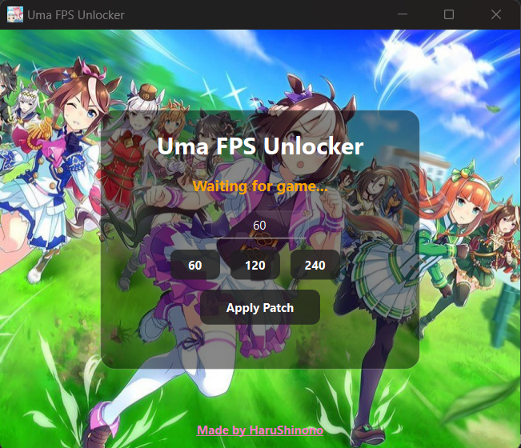

# Umamusume FPS Unlocker

A simple tool that unlocks and customizes the FPS limit for **Uma Musume Pretty Derby** on Windows.

This tool modifies the game's memory at runtime to allow higher frame rates than the default limit.

---

## Features

* Unlock the default FPS cap
* Set custom FPS values (e.g. **60 / 120 / 240**)
* Automatically detects when the game process is running
* Simple and lightweight UI
* One-click patch application

---

## Download/ Installation

The compiled executable is already included in this repository.

**Just download and run**:

```
umafps.exe
```
No installation is required.
...Or you prefer the harder way....

1. Clone this repository.
   ```
   git clone https://github.com/HaruShinono/Umamusume-FPS-Unlocker
   ```
2. Install dependencies:
    ```
    pip install -r requirements.txt
    ```
3. Run the script:
    ```
    python umafps.py
    ```
---

## How to Use

1. **Launch the game first**

   Start **Uma Musume Pretty Derby** and wait until the game is fully running.

2. **Run the tool**

   Open:

   ```
   umafps.exe
   ```
    Or run the script:
    ```
    python umafps.py
    ```
   
3. **Wait for detection**

   The tool will automatically detect the running game.

   Status will change from:

   ```
   Waiting for game...
   ```

   to:

   ```
   Game detected
   ```

4. **Set your desired FPS**

   You can either:

   * Enter a custom value in the FPS box
   * Or click a preset button (**60 / 120 / 240**)

5. **Apply the patch**

   Click:

   ```
   Apply Patch
   ```

   If successful, the FPS limit will update immediately.

---

## ⚠️ Notes

* The game **must be running before applying the patch**.
* Running the tool as **Administrator** may be required in some cases.
* This tool only modifies memory during runtime.
* **Warning: Modifying game behavior may violate the TOS.**
---
If you find this project useful, consider giving it a ⭐ on GitHub.
